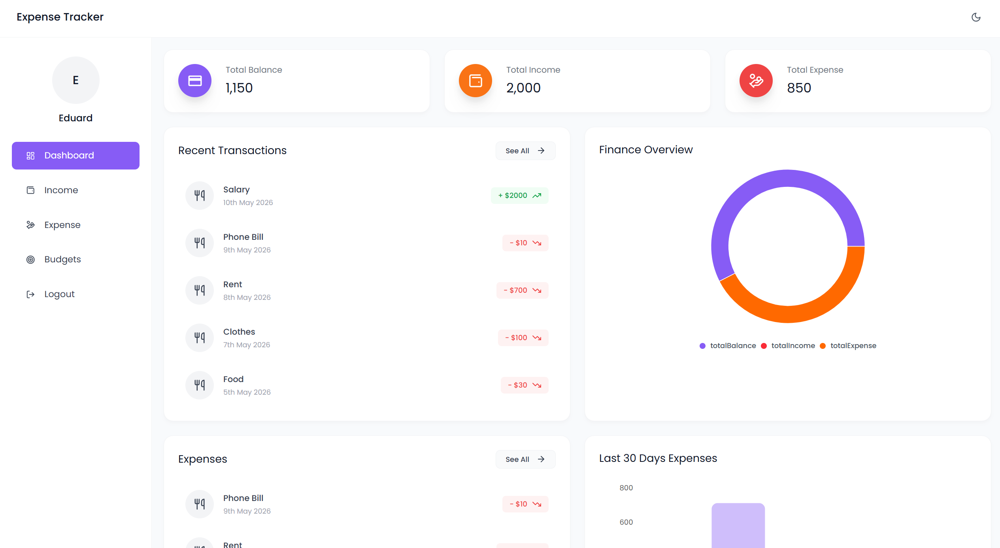

<div align="center">

# Smart Spend

**Personal finance tracker — TypeScript across the stack**

</div>

---

## Overview

Smart Spend is a full-stack web application for tracking personal income and
expenses. Users get a protected dashboard with charts, per-category budget
limits, transaction filters, and Excel exports — all with full dark mode
support.



---

## Features

**Transactions**

- Add, edit, view, and delete income and expense records with emoji icons
- Optional free-text note on every record, matched by search
- Debounced search and multi-field filters — by date range, amount, and category/source
- Paginated lists (20 per page) with server-side sorting
- Export filtered results to Excel (.xlsx), capped at 10k rows

**Budgets**

- Set monthly spending limits per category
- Live progress bars that turn amber at 80% and red at 100%
- Month navigator to review past and future budgets
- Summary strip: total limit, total spent, number of over-budget categories

**Dashboard**

- Balance, total income, and total expense summary cards
- Last 30 days expenses bar chart
- Last 60 days income area chart
- Finance overview pie chart
- Recent transactions feed

**UI & UX**

- Amounts formatted in the currency chosen on the profile page
- Dark mode with system preference detection, applied before first paint
- Responsive layout, skeleton loaders, accessible dialogs (focus trap, Escape)
- Protected routes that check session expiry, not just its presence
- Route-level code splitting

**Security**

- JWT issued as an httpOnly cookie, so page scripts can never read it
- bcrypt password hashing; changing a password retires every session issued
  before it, on every device
- Every request body, param and query validated with zod
- Rate limits on auth, upload and the API as a whole
- `helmet`, a 100 kB JSON body cap, and a CORS allowlist
- Ownership enforced on every read and delete
- Uploads restricted to 2 MB images with server-generated filenames

---

## Tech Stack

**Frontend**

| | |
| ------------------ | ----------------------------------------------- |
| React 19 + Vite | UI framework and build tool |
| TypeScript | Strict mode |
| Tailwind CSS 3 | Utility-first styling with `darkMode: "class"` |
| TanStack Query | Server state, caching, pagination |
| Recharts | Bar, area, and pie charts |
| Axios | HTTP client with request/response interceptors |
| React Router 7 | Client-side routing with protected routes |
| date-fns | Date formatting |
| Vitest + Testing Library | Unit and component tests |

**Backend**

| | |
| -------------------- | ------------------------------- |
| Node.js + Express 5 | REST API server |
| TypeScript | Strict mode, compiled with tsc |
| MongoDB + Mongoose 8 | Database and ODM |
| zod | Request validation and inferred types |
| bcryptjs | Password hashing |
| jsonwebtoken | JWT generation and verification |
| multer | Profile image uploads |
| exceljs | Excel file generation |
| Vitest + supertest | Integration tests on an in-memory MongoDB |

---

## Project Layout

```
backend/src      Express API — routes, controllers, models, middleware
frontend/src     React SPA — pages, components, hooks, contexts
shared/types.d.ts  Wire contract imported by both sides as @shared/types
```

`shared/types.d.ts` is the single source of truth for every response shape.
Changing a field there breaks whichever side has not been updated, at compile
time rather than in the browser.

### Amounts

Amounts are stored and transmitted as **integer minor units** (cents).
Doubles cannot hold most decimal fractions exactly, so summing them drifts —
a hundred entries of `0.07` add up to `7.000000000000004`. Integers keep every
total exact; formatting happens only at render, via `frontend/src/utils/money.ts`.

Request bodies still carry decimals (`amount: 12.50`) — the zod schema converts
on the way in. Responses carry minor units (`1250`).

**Upgrading an existing database** requires a one-off rescale:

```bash
cd backend
npm run migrate:minor-units
```

It records completion in a `migrations` collection, so a second run is a no-op
rather than multiplying every amount by 100 again.

---

## Getting Started

### Prerequisites

- Node.js 20+
- MongoDB (local or [Atlas](https://www.mongodb.com/atlas))

### Backend

```bash
cd backend
cp env.example .env
# Edit .env — set MONGO_URI and JWT_SECRET at minimum
npm install
npm run dev          # tsx watch, port 5000
```

### Frontend

```bash
cd frontend
cp env.example .env
# Edit .env — set VITE_API_URL=http://localhost:5000
npm install
npm run dev          # vite, port 5173
```

### Scripts

Both packages expose the same set:

| Script | Effect |
| ----------- | ------------------------------------ |
| `dev` | Run with hot reload |
| `build` | Typecheck, then compile/bundle |
| `start` | Run the compiled API (backend only) |
| `typecheck` | `tsc --noEmit` |
| `lint` | ESLint (frontend only) |
| `test` | Vitest, single run |
| `test:watch`| Vitest, watch mode |

---

## Environment Variables

### Backend — `backend/.env`

| Variable | Required | Description | Example |
| ---------------- | -------- | ------------------------------------------------ | --------------------------------------- |
| `MONGO_URI` | yes | MongoDB connection string | `mongodb://localhost:27017/smart_spend` |
| `JWT_SECRET` | yes | Secret key for signing JWT tokens | any long random string |
| `CLIENT_URL` | no | Allowed CORS origin(s), comma-separated | `http://localhost:5173` |
| `PORT` | no | Port the API listens on (default 5000) | `5000` |
| `JWT_EXPIRES_IN` | no | Token lifetime (default `7d`) | `7d` |
| `SESSION_MAX_AGE_MS` | no | Session-cookie lifetime; keep in step with the token | `604800000` |
| `CROSS_SITE_COOKIES` | no | Set to `1` when the API and the SPA are on different sites — issues the cookie `SameSite=None; Secure`, so it needs HTTPS | `1` |
| `PUBLIC_URL` | no | Base URL used to build uploaded-image links | `https://api.example.com` |
| `TRUST_PROXY` | no | Set to `1` behind a reverse proxy so rate limiting sees the real IP | `1` |
| `NODE_ENV` | no | `development` \| `production` \| `test` | `production` |

### Frontend — `frontend/.env`

| Variable | Description | Example |
| -------------- | --------------------------- | ----------------------- |
| `VITE_API_URL` | Base URL of the backend API | `http://localhost:5000` |

---

## API Reference

Base path `/api/v1`. Every endpoint except `/auth/register`, `/auth/login` and
`/auth/logout` requires a session. Browsers send the httpOnly cookie issued at
login automatically — send requests with credentials. Non-browser clients may
pass `Authorization: Bearer <token>` instead.

### Auth

| Method | Path | Body | Returns |
| ------ | -------------------- | ------------------------------------------ | ---------------------------- |
| POST | `/auth/register` | `fullName`, `email`, `password`, `profileImageUrl?` | `{ id, user, expiresAt }` + session cookie |
| POST | `/auth/login` | `email`, `password` | `{ id, user, expiresAt }` + session cookie |
| POST | `/auth/logout` | — | Clears the session cookie |
| GET | `/auth/getUser` | — | `User` |
| PATCH | `/auth/profile` | `fullName`, `email`, `currency` | `User`; 400 if the email is taken |
| PATCH | `/auth/password` | `currentPassword`, `newPassword` | New session cookie; retires tokens issued earlier |
| DELETE | `/auth/profile-image` | — | `User` with the avatar cleared |
| POST | `/auth/upload-image` | multipart `image` (≤ 2 MB, jpeg/png/webp) | `{ imageUrl, user }` |

### Income and Expense

`:kind` is `income` or `expense`.

| Method | Path | Notes |
| ------ | ---------------------------- | ------------------------------------------ |
| POST | `/:kind/add` | `source`/`category`, `amount`, `date`, `icon?`, `note?` (≤ 280 chars) |
| GET | `/:kind/get` | Paginated, filterable — see below |
| PUT | `/:kind/:id` | Same body as create; owner only, 404 otherwise |
| DELETE | `/:kind/:id` | Owner only; 404 otherwise |
| GET | `/:kind/downloadexcel` | Same filters, returns .xlsx |

Query params for `get` and `downloadexcel`:

| Param | Type | Default | Notes |
| ----------- | ------------------ | ------- | ---------------------------- |
| `search` | string | — | Case-insensitive, regex-escaped; matches the category/source **and** the note |
| `from`,`to` | `YYYY-MM-DD` | — | Inclusive on both ends |
| `minAmount`, `maxAmount` | number | — | Inclusive |
| `sortBy` | `date` \| `amount` | `date` | Anything else is ignored |
| `order` | `asc` \| `desc` | `desc` | |
| `page` | number | `1` | |
| `limit` | number | `20` | Capped at 100 |

Response: `{ data: T[], pagination: { total, page, limit, totalPages, hasNextPage, hasPrevPage } }`

### Budgets

| Method | Path | Notes |
| ------ | -------------------- | ----------------------------------------------- |
| GET | `/budget?month=YYYY-MM` | Defaults to the current month; adds `spent`, `remaining`, `percentUsed` |
| POST | `/budget` | Upsert by `(category, month)` |
| DELETE | `/budget/:id` | Owner only |

`percentUsed` is not capped — a value above 100 means the category is over
budget by that margin.

### Dashboard

| Method | Path | Notes |
| ------ | ------------ | -------------------------------------------------- |
| GET | `/dashboard` | Totals, 30-day expense spend grouped by category, 60-day income grouped by source, and the 10 most recent transactions across both ledgers |

### Other

| Method | Path | Notes |
| ------ | --------- | -------------------------------- |
| GET | `/health` | Liveness and DB connection state |

---

## Testing

```bash
cd backend && npm test     # integration tests on an in-memory MongoDB
cd frontend && npm test    # unit and component tests
```

CI runs typecheck, lint, tests and a production build for both packages on
every push and pull request.
